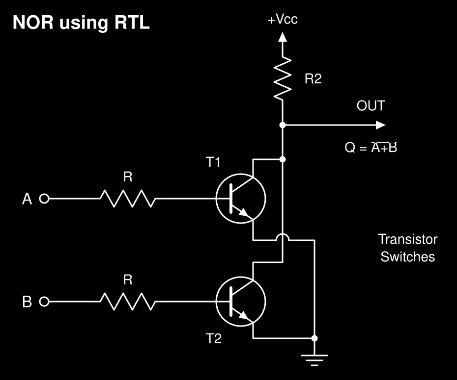
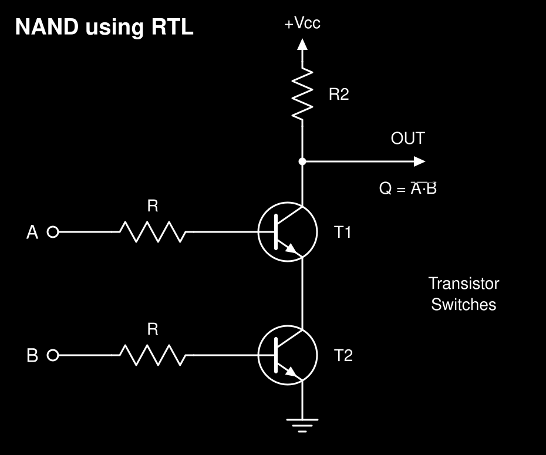

# RTL Simulations

Manim animations of RTL NOR and NAND gates with animated current flow and a truth table that fills in step by step.

<p align="center">
  
  
</p>

## Repository tree

```
.
├── rtl_gates.py        NORGate and NANDGate scenes
├── requirements.txt    Pinned dependencies (manim 0.21.0)
├── assets/             README schematics (rtl_nor.svg, rtl_nand.svg)
├── media/              Manim output (generated)
│   └── videos/rtl_gates/<quality>/{NORGate,NANDGate}.mp4
└── rtl/                Virtual environment (git-ignored)
```

## Setup

Requires Python 3.11 to 3.14. LaTeX is not needed. FFmpeg is only needed to join videos.

### macOS

```bash
brew install python pkg-config cairo pango ffmpeg
python3 -m venv rtl && source rtl/bin/activate
pip install -r requirements.txt
```

### Windows (PowerShell)

```powershell
winget install Python.Python.3.13
winget install Gyan.FFmpeg
py -m venv rtl; .\rtl\Scripts\Activate.ps1
pip install -r requirements.txt
```

If activation is blocked: `Set-ExecutionPolicy -Scope CurrentUser RemoteSigned`.

### Linux

```bash
# Debian / Ubuntu
sudo apt install python3-venv python3-dev build-essential pkg-config libcairo2-dev libpango1.0-dev ffmpeg
# Fedora
sudo dnf install python3-devel gcc pkg-config cairo-devel pango-devel ffmpeg-free
# Arch
sudo pacman -S python base-devel pkgconf cairo pango ffmpeg

python3 -m venv rtl && source rtl/bin/activate
pip install -r requirements.txt
```

## Usage

```bash
manim -qh rtl_gates.py NORGate NANDGate   # 1080p60
manim -pql rtl_gates.py NORGate           # fast preview, opens when done
```

Quality flags: `-ql` 480p15, `-qm` 720p30, `-qh` 1080p60, `-qp` 1440p60, `-qk` 2160p60.

Join both videos:

```bash
cd media/videos/rtl_gates/1080p60
printf "file 'NORGate.mp4'\nfile 'NANDGate.mp4'\n" > list.txt
ffmpeg -f concat -safe 0 -i list.txt -c copy RTL_NOR_then_NAND.mp4 && rm list.txt
```

## Code structure

- **Drawing helpers**: `poly`, `zigzag_pts`, `transistor`, `input_branch`, `vcc`, `ground`, `junction`, `terminal`, `triangle`. All coordinates pass through `P(x, y)`, which applies `OFFSET`.
- **`Flow`**: dots along a polyline, driven by a shared `ValueTracker` clock. Dot `i` sits at `((t * SPEED - D) % SPACING) + i * SPACING`.
- **`RTLGate`**: base scene. Draws the watermark, circuit and empty table, then for each input combination updates labels, highlights the row, adds flows, and writes the row.
- **`NORGate.build` / `NANDGate.build`**: return the circuit, labels, named current segments, and combos. Each combo lists `chains` (segments in current order) and `bases` (base-current segment mapped to the segment it joins). `make_flows` sets each segment's phase `D` from the chain so dots stay continuous across junctions.

## Configuration

Constants at the top of `rtl_gates.py`:

| Constant | Default | Purpose |
|----------|---------|---------|
| `SPEED` | `3.2` | Dot speed (units/s) |
| `SPACING` | `0.30` | Dot spacing |
| `DOT_R` | `0.075` | Dot radius |
| `DOT` / `INK` | `#FFE600` / `#FFFFFF` | Dot and drawing colours |
| `WIRE` | `4` | Wire stroke width |
| `FONT` | `Helvetica` | Label font (falls back to default sans on Windows/Linux) |
| `HOLD` | `4.5` | Seconds per input combination |
| `OFFSET` | `[-0.4, -0.1, 0]` | Circuit position |
| `TABLE_LEFT`, `TABLE_TOP`, `COLS`, `ROW_H` | | Truth table layout |

Watermark opacity and angle are set in `RTLGate.construct` (`set_opacity(0.14)`, `rotate(20 * DEGREES)`).

## Troubleshooting

- `pycairo` / `manimpango` build fails: install the Cairo/Pango packages for your platform.
- Stale output after edits: render with `--disable_caching`.

## Author

Parth Pancholi
